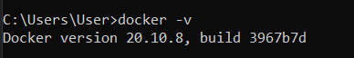
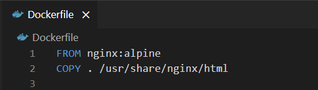
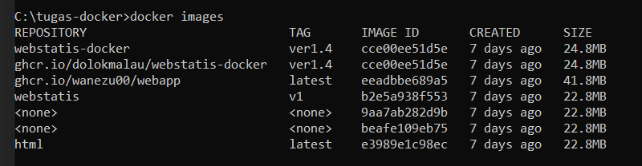

Nama 	: Dolok Malau

NIM 	: 191402114

Laporan Menjalankan Website Dengan Docker

1. # **Instal Docker dan Nginx**

1. ## **Instal Docker**
- Pertama download docker melalui link <https://www.docker.com/get-started>
- Setelah itu instal aplikasi yang baru diunduh tadi.
- Setelah selesai, lakukan cek apakah docker sudah terinstal atau belum dengan cara buka CMD dan ketikkan “**docker -v**”.

- Jika ditampilkan seperti gambar diatas, berarti docker sudah terinstal

1. ## **Instal WSL**
- Setelah selesai instalasi docker, kita juga harus menginstal WSL agar docker dapat berjalan.
- Pertama buka **Turn Windows Features On or Off** pada **Start**

- Lalu ceklis bagian “**Virtual Machine Platform**” dan “**Windows Subsystem for Linux**”
- Lalu unduh WSL, untuk mengunduhnya dapat mengklik link dibawah
- <https://wslstorestorage.blob.core.windows.net/wslblob/wsl_update_x64.msi>
- Setelah selesai diunduh silahkan instal WSL.
- Lalu setelah selesai menginstal, buka software **Windows Powershell** pada **Start** dengan **Run As Administrator**

- Setelah itu ketik “wsl --set-default-version 2”, hasilnya akan seperti gambar diatas.

1. ## **Instal Nginx**
- Pertama download nginx dari website resminya <https://nginx.org/en/download.html>

- Setelah itu Extract file rar yang diunduh sebelumnya dan letakkan pada local disk yang diinginkan.
1. # **Menjalankan Website Dengan Docker**
1. ## **Tahapan Awal**
- Pertama jalankan software Nginx dan Docker.

- Untuk mengecek apakah Nginx berjalan, buka “**localhost**” pada browser, jika tampilannya seperti gambar diatas, berarti Nginx sudah berjalan.

- Setelah itu buat satu folder baru dengan nama sesuai keinginan disini saya folder saya adalah “**tugas-docker**”, dimana folder tersebut akan menampung file-file yang dibutuhkan oleh website yang akan dijalankan.

- Lalu kita perlu membuat satu file bernama “**Dockerfile**” penamaan harus percis sama, lalu didalam file tersebut isi perintah seperti gambar diatas.

- Lalu buka folder tersebut dengan CMD.
- Sebelum menggunakan Docker, pastikan website yang akan diluncurkan sudah benar-benar selesai, karena jika ternyata terdapat kekurangan pada website, maka kita harus mengulangi **2.** **Tahapan Menggunakan Docker** dari langkah awal.
1. ## **Tahapan Menggunakan Docker**
- **Perlu diingat bahwa dalam penulisan penamaan, baik images atau container, dilarang menggunakan huruf kapital, karena akan terjadi error**
- Pertama kita akan membuat images, yang mana images inilah yang nanti dapat diberikan kepada anggota lain agar dapat dibuka pada dockernya masing-masing.
- Untuk membuat images adalah dengan mengetik perintah “**docker build -t nama-images:tag .**”

- Untuk “**nama-image**” dan “**tag**” dapat dibuat sesuai keinginan, contoh “**docker build -t webstatis-docker:ver1.4 .**”

- Untuk mengetahui apakah Image berhasil dibuat, silahkan ketik perintah “docker images”, nama images akan tampil seperti diatas, images sebelumnya bernama “webstatis-docker”.
- Lalu selanjutnya kita akan membuat container menggunakan images yang sudah dibuat sebelumnya, agar images dapat dibuka melalui web browser.

- Untuk membuat container dapat langsung mengetikkan perintah “docker run -d --name **nama-container** -p **port**:80 **nama-image:tag**”
- Untuk “**nama-container**” dapat dibuat sesuai keinginan, untuk “**port**” juga dapat dibuat sesuai keinginan (nomor) tetapi usahakan nomor berulang seperti 8181,8080, dll.
- Tetapi untuk “**nama-image**” dan “**tag**” harus sesuai dengan images yang ingin dijalankan.

- Contohnya saya ingin menjalankan image sebelumnya yang bernama **webstatis-docker** dan memiliki TAG **ver1.4** pada port 8282, berarti saya harus mengetikkan perintah “docker run -d --name webstatis-container -p **8282**:80 webstatis-docker:ver1.4”
- Sekarang semua sudah selesai, kita tinggal menjalankan website yang sudah dikaitkan dengan docker, caranya adalah dengan membuka Web Browser.
- Setelah itu ketik pada URL Browser “localhost:**port**”, karena saya tadi membuat port **8282**, maka url saya adalah “localhost:**8282**”.

- Jika berhasil seharusnya yang ditampilkan adalah tampilan website yang diinginkan.
- Jika sudah selesai memakai container, kita juga dapat menghentikan container tersebut.

- Caranya adalah dengan mengetikkan perintah “docker stop **nama-container**”, karena nama container saya adalah webstatis-container, maka perintahnya “docker stop **webstatis-container**”.

- Tampilannya akan seperti diatas.

1. # **Mengupload Images Ke Github**
- Untuk mengupload file-file website ke repository github tidaklah sulit, tetapi mengupload file images docker ke github membutuhkan cara khusus.
- Pertama kita harus mengambil token github kita yang nanti akan digunakan untuk keperluan login.
- Caranya adalah masuk dahulu ke github.com dan login.
- Setelah itu klik link ini <https://github.com/settings/tokens>

- Setelah itu klik **Generate New Token**, seperti gambar diatas.

- Lalu isi bagian **Note** sesuai keinginan, lalu centang pilihan write dan delete packages, seperti gambar diatas, lalu scroll kebawah dan klik **Generate Token**

- Setelah itu akan tampil token, silahkan copy dahulu karena nanti akan digunakan (Perhatian, token ini tidak boleh diberikan kepada siapapun).

- Lalu silahkan buka CMD dan ketik “docker login ghcr.io --username **username/email-github**”, sebagai contoh “docker login ghcr.io --username **dolokm01@gmail.com**”, lalu dibawahnya akan diminta password, silahkan langsung copy paste saja token yang sebelumnya sudah didapatkan, jika berhasil akan muncul pesan “Login Succeded”.

- Lalu setelah itu ketik perintah “docker tag **id-images** ghcr.io/**nama-images**:**tag**”.
- Untuk mengetahui **id-images**, silahkan ketik “docker images”.

- Karena saya ingin mengupload image webstatis-docker, maka saya hanya perlu mengcopy id **cce00ee51d5e** dan untuk **nama-images** dan **tag** dapat ditulis sesuai keinginan, tetapi lebih baik disamakan dengan image aslinya.

- Sehingga perintah yang perlu saya tulis adalah “docker tag **cce00ee51d5e** ghcr.io/**webstatis-docker**:**ver1.4**”.
- Setelah itu ketik lagi perintah “docker push ghcr.io/**namapemilik**/**nama-images**:**tag**”

- Untuk **namapemilik** dapat disesuaikan dengan nama dari github (**tanpa ada huruf besar**) dan untuk **nama-images** dan **tag** dapat dibuat sesuai dengan nama images yang digunakan.
- Sehingga saya menuliskan perintah seperti ini “docker push ghcr.io/**dolokmalau**/**webstatis-docker**:**ver1.4**”
- Tunggu hingga proses upload selesai.
- Jika sudah selesai, kamu dapat mengeceknya dengan cara masuk ke website github.com

- Lalu klik dropdown menu paling kanan, dan pilih **Your Repository**.

- Lalu setelah itu pilih menu **Packages** dan akan ditampilkan package yang kamu sudah upload.
- Tutorial sudah selesai.
1. # **Tampilan Website Saya**

